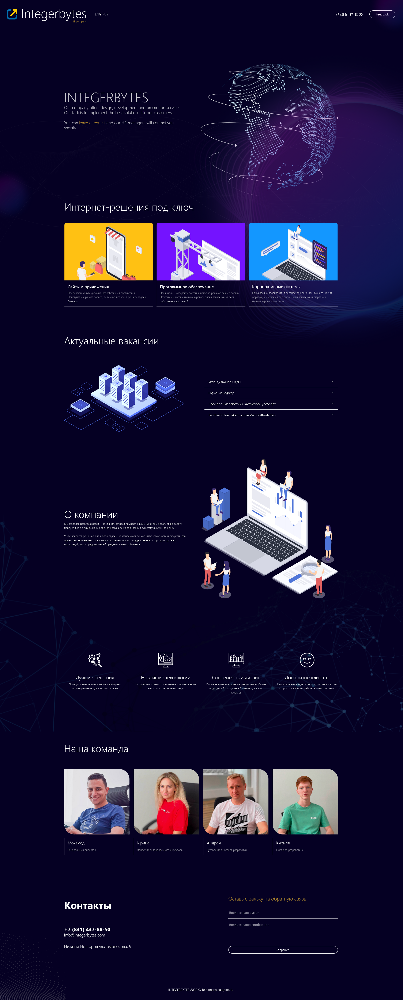

<p align="center">

</p>

### Getting Started with [Next.js](https://nextjs.org/)

First, run the development server:

```bash
npm run dev
# or
yarn dev
```

<p>This site is the official site of Integerbytes company.</p>


